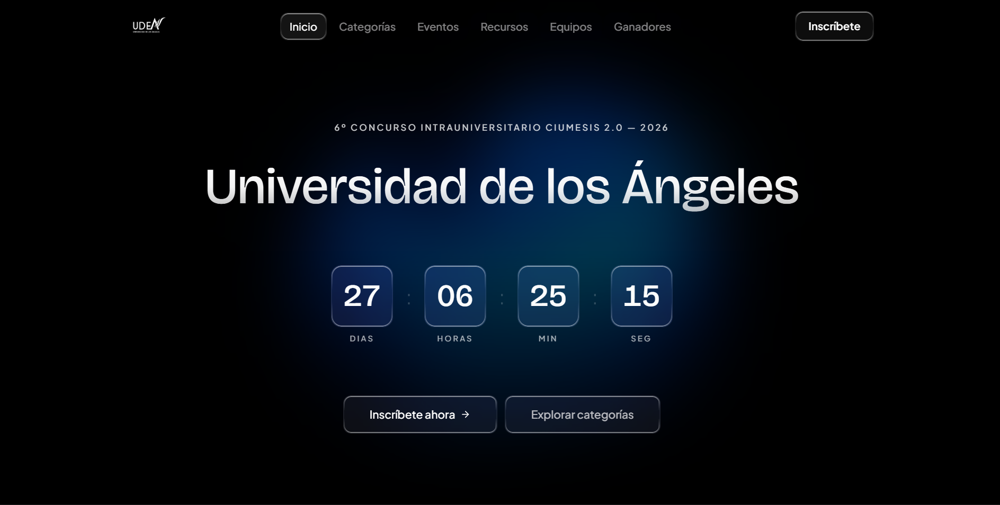

# Concurso UDEA 2026

Repositorio oficial de la pagina web del concurso de la Universidad de los Angeles.

  

🌐 **[udeaconcurso.site](https://udeaconcurso.site)**

## Tecnologías

- **React** — Interfaz de usuario.
- **Vite** — Bundler y entorno de desarrollo
- **Tailwind CSS** — Estilos
- **Supabase** — Base de datos, autenticación y almacenamiento
- **Framer Motion** — Animaciones
- **Cloudflare Workers** — Despliegue

## Autor

Desarrollado por **[Danielnvcd](https://danielnvcd.site)**